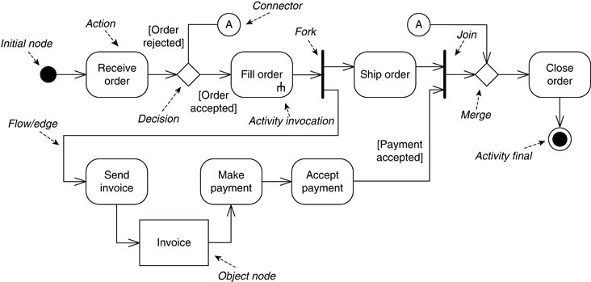

# Diagrama de actividades

 

Un diagramas de actividades muestra cómo los eventos de un caso de uso se relacionan entre sí o cómo una colección de casos de uso se coordinan.

## Elementos de un diagrama de actividades:

**Nodo inicial**: Inicia el diagrama ().

**Nodo final**: Termina el diagrama ().

**División (fork)**: Ocurren varias acciones a la vez ().

**Flujo**: Flujo del diagrama ().

**Unión (Join)**: Las acciones concluyen en un punto ().
