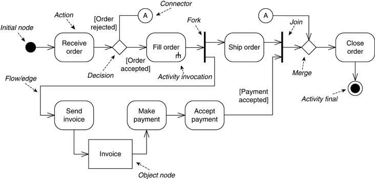

# Diagrama de actividades

 

**Nodo inicial**: Inicia el diagrama ().

**Nodo final**: Termina el diagrama ().

**División (fork)**: Ocurren varias acciones a la vez ().

**Flujo**: Flujo del diagrama ().

**Unión (Join)**: Las acciones concluyen en un punto ().
