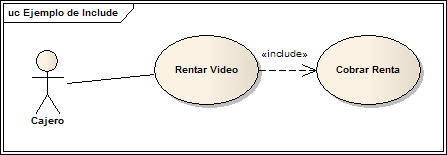
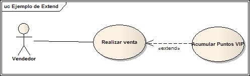

__Herencia__ : una entidad padre hedera un comportamiento a una entidad hija queesta a su vez tendrá sus propios comportamientos.

__Include__ : Caso de uso obligatorio para otro caso de uso relacionado.

__Extend__ : caso de uso opcional relacionado con otro caso de uso.

